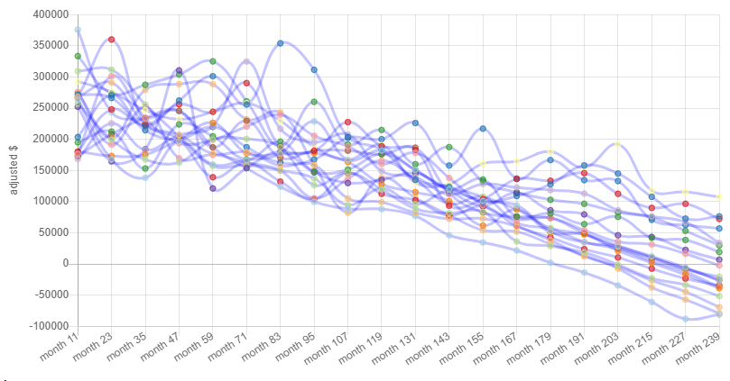
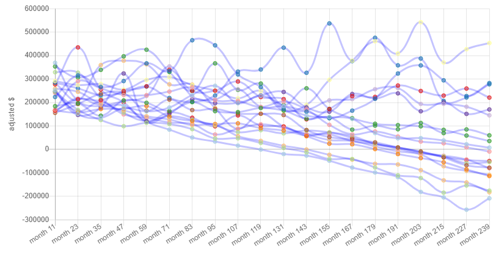
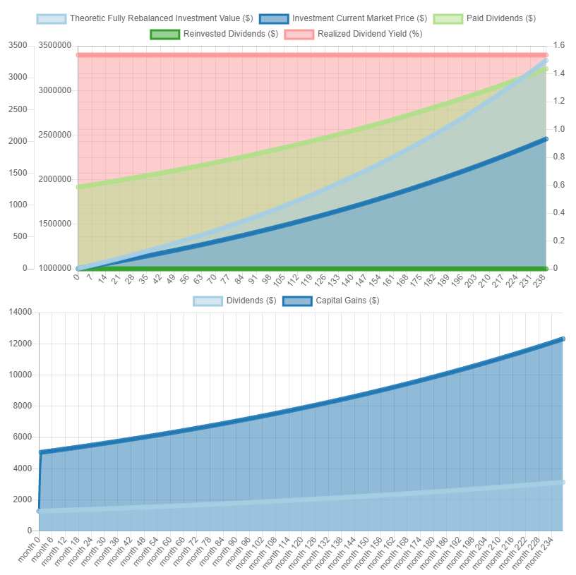

# Cashflow: an Economic Scenario Generator for Passive Investments

# Manifesto

## Assumptions

The app embodies the following assumptions:

* Current market value is a faulty measure of retirement portfolios and portfolio health.
* The intrinsic value of investment securities
    * is driven by:
        * the current cashflow generated by the security.
        * growth of the security cashflow.
    * is fairly stable and forecastable over long terms. [TODO cite articles]
* The market price is driven by, in addition the intrinsic value, also the discount rate of future cashflows, which:
    * is driven by:
        * inflation and inflation expectations.
        * market sentiment.
    * is very unstable and produces the market crashes and bubbles we all know and love.

Both the intrinsic value and the discount rate evolve over time. The standard way to think about risk focuses on the
short-term, where the discount rate reigns supreme and drowns all in noise. As a consequence, most people simply assume
a fixed rate of growth of their portfolio, sprinkle a bit of volatility and call that analysis. This view is,
regrettably, wholly deficient in both extreme environments, where market valuations can get a bit out of whack, and a
fixed future growth rate is unrealistic.

[comment]: <> (TODO environments of sustained bull markets, when the discount rate volatility gets ridiculously low and
consequently future returns should be low)

The goal of the application is to provide a convenient way to visualize, analyze and simulate the long-term behavior of
investment portfolios based on their cashflows.

(TODO rewrite) The Gordon equation provides a fairly accurate trend of the security price over the long term. We also need to consider 
the long-term market sentiment, which accounts for a portion of the realized long-term return as well - historically 
markets had demanded a higher stock premium, so the realized return was larger, while in the future they may revert to a 
different mode and the realized return would consequently be lower.

### Gordron Equation

Research shows [TODO cite] that long-term growth fairly closely follows the intrinsic value, which is expressed via the Gordon equation. The Gordon equation implies a long-term equity market return equal to:

,

where mr is the market return, cdy is the current dividend yield, dg is the (real) dividend growth and infl is the
realized inflation.

### Market Sentiment

Note that there is a natural limit imposed on the market return that the participants must ask - it must be smaller 
than the long-term nominal dividend growth:

If that is broken, any market price can be justified.

The market sentiment - represented by the log-change of the required market return - is a mean-reverting process:

 + lmr^{res}_{t+1}>),

where TODO describe vars

We impose the limit imposed on the market sentiment by the Gordon equation by just allowing the randomization of the part
of the market return above the minimum limit.

## Dividends

There is a recent-ish resurgence of the cargo cult masquerading as investing that assumes that dividends are not
important. Quite the opposite, dividends, and especially the long-term expectation of dividends is what allows
investment assets to have quantitative value.

There is a paradox that dividends themselves are fairly stable over time, and their volatilities are order of magnitude
lower than the volatility of the stock market. This means that dividends forecasts are more stable and accurate than
market movement forecasts.

In this application the dividends amounts are assumed to have a white noise random realization represented by a dividend
growth multiplier, showing:

 \times rdgr_t>),

where  >),
i.e. the multiplier is a lognormal random variable with mean of 1 and given standard deviation.

Our assumption is that the current dividend amount is pretty stable - it grows as a white noise with small volatility.

A quick review of the S&P dividends in 2014-2021 (TODO this is too short and may not be representative long-term, re-do
the analysis with more data) shows standard deviation of annual dividend log-change to be 0.03, so this is the default
value provided, the portfolio value with different random realizations is still pretty compactly distributed:

If instead we assumed higher (quite unrealistic) volatility of actual realized dividends, the chart produces much bigger
difference between realizations:

This is similar to what simply the simulation of independent random market returns will produce.

## Screenshots

[CC-BY-NC-SA-4.0](LICENSE.md)
